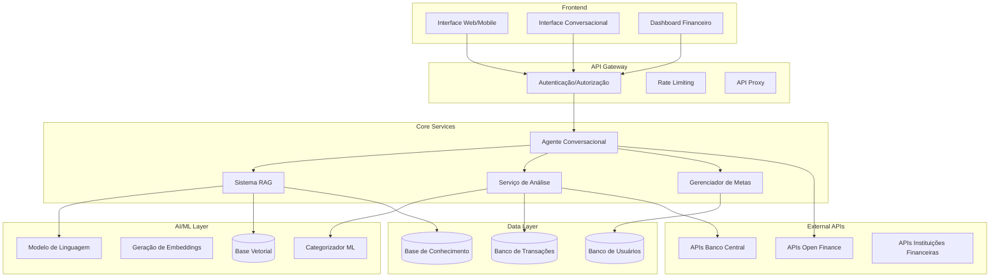
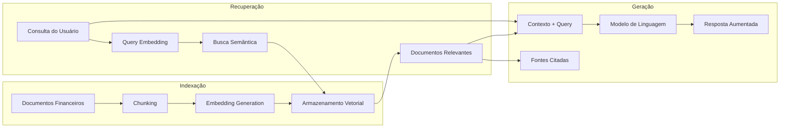
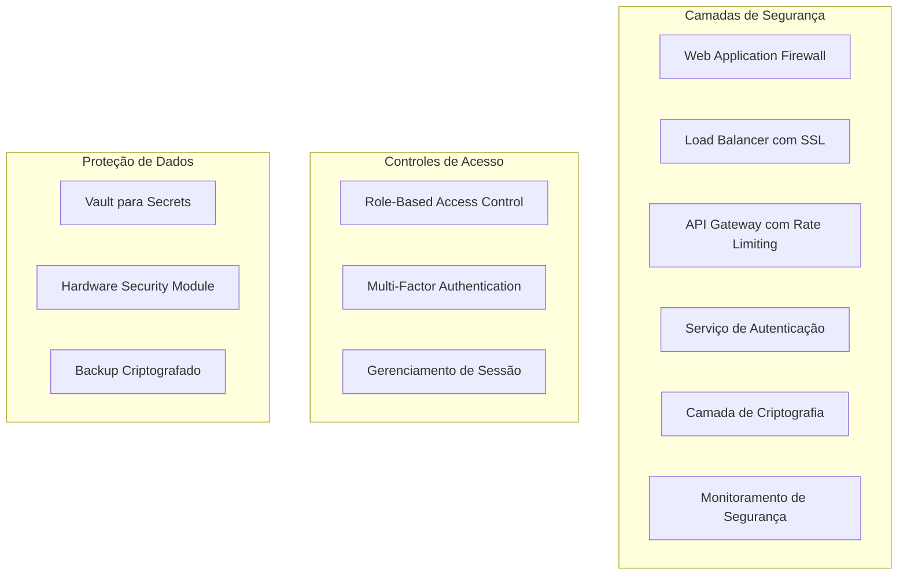

# Documento de Design

## Visão Geral

O Agente de IA Financeira é um sistema baseado em arquitetura RAG (Retrieval-Augmented Generation) que combina a capacidade generativa de LLMs com sistemas de recuperação de informação para fornecer orientação financeira personalizada e confiável. O sistema integra-se de forma segura com contas bancárias através das APIs do Open Finance, analisa padrões transacionais usando machine learning, e oferece uma interface conversacional natural para educação e consultoria financeira.

A arquitetura híbrida permite que o agente acesse bases de conhecimento financeiro atualizadas durante a inferência, mitigando limitações de conhecimento estático dos LLMs tradicionais e reduzindo alucinações através do grounding em fontes confiáveis.

## Arquitetura

### Arquitetura Geral do Sistema



### Arquitetura RAG Detalhada



## Componentes e Interfaces

### 1. Sistema de Autenticação e Autorização

**Responsabilidades:**
- Autenticação multifatorial de usuários
- Gerenciamento de tokens JWT
- Controle de acesso baseado em papéis (RBAC)
- Integração com provedores OAuth2 das instituições financeiras

**Interfaces:**
```python
class AuthService:
    def authenticate_user(self, credentials: UserCredentials) -> AuthToken
    def validate_token(self, token: str) -> UserSession
    def refresh_token(self, refresh_token: str) -> AuthToken
    def revoke_access(self, user_id: str, institution_id: str) -> bool
```

### 2. Integrador Open Finance

**Responsabilidades:**
- Conexão segura com APIs das instituições financeiras
- Sincronização de dados transacionais
- Gerenciamento de consentimentos conforme regulamentação
- Cache inteligente para otimização de chamadas

**Interfaces:**
```python
class OpenFinanceIntegrator:
    def connect_account(self, user_id: str, institution_id: str, consent: ConsentData) -> ConnectionResult
    def sync_transactions(self, account_id: str, date_range: DateRange) -> List[Transaction]
    def get_account_balance(self, account_id: str) -> AccountBalance
    def revoke_consent(self, consent_id: str) -> bool
```

### 3. Processador de Transações

**Responsabilidades:**
- Categorização automática usando modelos ML
- Detecção de duplicatas e anomalias
- Normalização e enriquecimento de dados
- Cálculo de métricas financeiras

**Interfaces:**
```python
class TransactionProcessor:
    def categorize_transaction(self, transaction: Transaction) -> Category
    def detect_duplicates(self, transactions: List[Transaction]) -> List[DuplicateGroup]
    def calculate_spending_patterns(self, user_id: str, period: TimePeriod) -> SpendingAnalysis
    def detect_anomalies(self, transactions: List[Transaction]) -> List[Anomaly]
```

### 4. Sistema RAG

**Responsabilidades:**
- Indexação de documentos financeiros
- Busca semântica em base de conhecimento
- Geração de respostas aumentadas
- Rastreabilidade de fontes

**Interfaces:**
```python
class RAGSystem:
    def index_documents(self, documents: List[Document]) -> IndexResult
    def semantic_search(self, query: str, filters: SearchFilters) -> List[RelevantDocument]
    def generate_response(self, query: str, context: List[Document], user_profile: UserProfile) -> RAGResponse
    def update_knowledge_base(self, new_documents: List[Document]) -> UpdateResult
```

### 5. Agente Conversacional

**Responsabilidades:**
- Processamento de linguagem natural
- Gerenciamento de contexto conversacional
- Orquestração de serviços
- Personalização de respostas

**Interfaces:**
```python
class ConversationalAgent:
    def process_message(self, message: str, session: ConversationSession) -> AgentResponse
    def maintain_context(self, session_id: str, interaction: Interaction) -> ConversationContext
    def personalize_response(self, response: str, user_profile: UserProfile) -> PersonalizedResponse
```

## Modelos de Dados

### Modelo de Usuário
```python
@dataclass
class User:
    id: str
    email: str
    profile: UserProfile
    preferences: UserPreferences
    created_at: datetime
    last_login: datetime
    
@dataclass
class UserProfile:
    risk_tolerance: RiskLevel
    financial_goals: List[FinancialGoal]
    income_range: IncomeRange
    age_group: AgeGroup
    financial_knowledge_level: KnowledgeLevel
```

### Modelo de Transação
```python
@dataclass
class Transaction:
    id: str
    account_id: str
    amount: Decimal
    currency: str
    date: datetime
    description: str
    category: Category
    subcategory: str
    merchant: Optional[str]
    location: Optional[Location]
    confidence_score: float
```

### Modelo de Conhecimento
```python
@dataclass
class KnowledgeDocument:
    id: str
    title: str
    content: str
    source: str
    category: DocumentCategory
    last_updated: datetime
    embedding: List[float]
    metadata: Dict[str, Any]
```

### Modelo de Conversa
```python
@dataclass
class ConversationSession:
    session_id: str
    user_id: str
    messages: List[Message]
    context: ConversationContext
    created_at: datetime
    last_activity: datetime

@dataclass
class Message:
    id: str
    content: str
    role: MessageRole  # USER, ASSISTANT, SYSTEM
    timestamp: datetime
    sources: Optional[List[Source]]
```

## Tratamento de Erros

### Estratégias de Recuperação

1. **Falhas de Conectividade com APIs Externas:**
   - Retry exponencial com jitter
   - Circuit breaker pattern
   - Fallback para dados em cache
   - Notificação proativa ao usuário

2. **Erros de Processamento ML:**
   - Fallback para categorização baseada em regras
   - Solicitação de feedback do usuário
   - Logging detalhado para retreinamento

3. **Falhas do Sistema RAG:**
   - Busca alternativa em índices secundários
   - Resposta baseada apenas no LLM com disclaimer
   - Escalação para suporte humano

4. **Violações de Segurança:**
   - Bloqueio automático de sessão
   - Notificação imediata ao usuário
   - Auditoria completa do incidente

### Códigos de Erro Padronizados

```python
class ErrorCodes:
    # Autenticação
    AUTH_INVALID_CREDENTIALS = "AUTH_001"
    AUTH_TOKEN_EXPIRED = "AUTH_002"
    AUTH_INSUFFICIENT_PERMISSIONS = "AUTH_003"
    
    # Open Finance
    OF_CONNECTION_FAILED = "OF_001"
    OF_CONSENT_EXPIRED = "OF_002"
    OF_RATE_LIMIT_EXCEEDED = "OF_003"
    
    # Processamento
    PROC_CATEGORIZATION_FAILED = "PROC_001"
    PROC_DUPLICATE_DETECTION_FAILED = "PROC_002"
    
    # RAG System
    RAG_SEARCH_FAILED = "RAG_001"
    RAG_GENERATION_FAILED = "RAG_002"
    RAG_KNOWLEDGE_BASE_UNAVAILABLE = "RAG_003"
```

## Estratégia de Testes

### Testes Unitários
- Cobertura mínima de 90% para componentes críticos
- Mocks para APIs externas
- Testes de edge cases para processamento financeiro
- Validação de conformidade LGPD

### Testes de Integração
- Testes end-to-end do fluxo conversacional
- Integração com APIs Open Finance em ambiente sandbox
- Testes de performance do sistema RAG
- Validação de segurança e criptografia

### Testes de Aceitação
- Cenários de uso baseados em personas
- Testes de usabilidade da interface conversacional
- Validação de precisão das categorizações
- Testes de conformidade regulatória

### Testes de Performance
- Load testing para 10.000 usuários simultâneos
- Stress testing do sistema RAG
- Testes de latência para respostas conversacionais (<2s)
- Monitoramento de uso de recursos

### Métricas de Qualidade RAG

1. **Métricas de Recuperação:**
   - Precision@K: Precisão dos K documentos mais relevantes
   - Recall@K: Cobertura dos documentos relevantes
   - NDCG: Qualidade do ranking dos resultados

2. **Métricas de Geração:**
   - BLEU Score: Qualidade linguística das respostas
   - ROUGE Score: Sobreposição com respostas de referência
   - BERTScore: Similaridade semântica

3. **Métricas Específicas RAG:**
   - Faithfulness: Fidelidade ao contexto recuperado
   - Answer Relevancy: Relevância da resposta à pergunta
   - Context Relevancy: Relevância do contexto recuperado

4. **Métricas de Negócio:**
   - Taxa de satisfação do usuário
   - Precisão das recomendações financeiras
   - Tempo de resolução de dúvidas
   - Taxa de retenção de usuários

## Stack Tecnológica e Fundação do Projeto

### Inspiração: TabNews Foundation

Seguindo a excelência técnica demonstrada no projeto TabNews (https://deepwiki.com/filipedeschamps/tabnews.com.br/1-overview), adotaremos uma fundação sólida focada em qualidade de código, manutenibilidade e boas práticas de desenvolvimento.

### Stack Principal

**Backend:**
- **Node.js** com **TypeScript** para type safety
- **Next.js** para API routes e SSR
- **MongoDB Atlas** como banco de dados principal
- **Prisma** como ORM para type-safe database access
- **Redis** para cache e sessões

**Frontend:**
- **Next.js 14** com App Router
- **React** com TypeScript
- **Tailwind CSS** para styling
- **Radix UI** para componentes acessíveis
- **React Hook Form** com Zod para validação

**AI/ML Stack:**
- **LangChain** para orquestração de LLMs
- **OpenAI GPT-4** ou **Anthropic Claude** como LLM principal
- **Sentence Transformers** para embeddings
- **Chroma** ou **Pinecone** como vector database
- **Hugging Face Transformers** para modelos locais

**Infraestrutura:**
- **Vercel** para deploy e hosting
- **MongoDB Atlas** para banco principal
- **Redis Cloud** para cache
- **AWS S3** para armazenamento de arquivos
- **Sentry** para error tracking
- **Posthog** para analytics

### Qualidade de Código (Inspirado no TabNews)

**Linting e Formatação:**
```json
// .eslintrc.json
{
  "extends": [
    "next/core-web-vitals",
    "@typescript-eslint/recommended",
    "prettier"
  ],
  "plugins": ["@typescript-eslint"],
  "rules": {
    "@typescript-eslint/no-unused-vars": "error",
    "@typescript-eslint/no-explicit-any": "warn",
    "prefer-const": "error",
    "no-var": "error"
  }
}
```

**Prettier Configuration:**
```json
// .prettierrc
{
  "semi": true,
  "trailingComma": "es5",
  "singleQuote": true,
  "printWidth": 80,
  "tabWidth": 2,
  "useTabs": false
}
```

**Husky + Lint-staged:**
```json
// package.json
{
  "husky": {
    "hooks": {
      "pre-commit": "lint-staged",
      "commit-msg": "commitlint -E HUSKY_GIT_PARAMS"
    }
  },
  "lint-staged": {
    "*.{js,jsx,ts,tsx}": [
      "eslint --fix",
      "prettier --write"
    ]
  }
}
```

### Estrutura do Projeto

```
financial-ai-agent/
├── .github/
│   └── workflows/
│       ├── ci.yml
│       └── deploy.yml
├── .husky/
├── .vscode/
│   └── settings.json
├── apps/
│   ├── web/                 # Next.js frontend
│   │   ├── app/
│   │   ├── components/
│   │   ├── lib/
│   │   └── types/
│   └── api/                 # API routes
│       ├── auth/
│       ├── transactions/
│       ├── chat/
│       └── rag/
├── packages/
│   ├── database/            # Prisma schema e migrations
│   ├── ai/                  # RAG system e LLM integrations
│   ├── open-finance/        # Open Finance integrations
│   ├── shared/              # Tipos e utilitários compartilhados
│   └── config/              # Configurações ESLint, Prettier, etc.
├── docs/
├── tests/
│   ├── unit/
│   ├── integration/
│   └── e2e/
├── docker-compose.yml
├── package.json
├── turbo.json               # Turborepo para monorepo
└── README.md
```

### MongoDB Atlas - Justificativa e Viabilidade

**Por que MongoDB Atlas é viável:**

1. **Flexibilidade de Schema:** Ideal para dados financeiros que podem ter estruturas variadas (diferentes bancos, tipos de transação)

2. **Escalabilidade:** Atlas oferece auto-scaling baseado em demanda

3. **Agregation Pipeline:** Perfeito para análises complexas de transações e padrões financeiros

4. **Vector Search:** Suporte nativo para embeddings (essencial para RAG)

5. **Compliance:** Certificações SOC 2, ISO 27001, adequadas para dados financeiros

6. **Backup Automático:** Point-in-time recovery essencial para dados críticos

### Schema MongoDB para Dados Financeiros

```typescript
// User Collection
interface User {
  _id: ObjectId;
  email: string;
  profile: {
    riskTolerance: 'conservative' | 'moderate' | 'aggressive';
    financialGoals: FinancialGoal[];
    incomeRange: string;
    ageGroup: string;
  };
  connectedAccounts: ConnectedAccount[];
  preferences: UserPreferences;
  createdAt: Date;
  updatedAt: Date;
}

// Transactions Collection
interface Transaction {
  _id: ObjectId;
  userId: ObjectId;
  accountId: string;
  amount: number;
  currency: string;
  date: Date;
  description: string;
  category: {
    primary: string;
    secondary?: string;
    confidence: number;
  };
  merchant?: {
    name: string;
    category: string;
  };
  location?: {
    lat: number;
    lng: number;
    address: string;
  };
  metadata: {
    source: 'open_finance' | 'manual';
    processed: boolean;
    anomaly_score?: number;
  };
  createdAt: Date;
}

// Knowledge Base Collection (para RAG)
interface KnowledgeDocument {
  _id: ObjectId;
  title: string;
  content: string;
  source: string;
  category: string;
  embedding: number[]; // Vector embedding
  metadata: {
    lastUpdated: Date;
    relevanceScore: number;
    tags: string[];
  };
  createdAt: Date;
}

// Conversations Collection
interface Conversation {
  _id: ObjectId;
  userId: ObjectId;
  sessionId: string;
  messages: Message[];
  context: {
    currentTopic?: string;
    userIntent?: string;
    relevantTransactions?: ObjectId[];
  };
  createdAt: Date;
  updatedAt: Date;
}
```

### Integração com Vector Search

```typescript
// Configuração do Atlas Vector Search
const vectorSearchIndex = {
  "name": "knowledge_vector_index",
  "type": "vectorSearch",
  "definition": {
    "fields": [
      {
        "type": "vector",
        "path": "embedding",
        "numDimensions": 1536, // OpenAI embeddings
        "similarity": "cosine"
      },
      {
        "type": "filter",
        "path": "category"
      }
    ]
  }
};

// Busca semântica no MongoDB
async function semanticSearch(query: string, category?: string) {
  const queryEmbedding = await generateEmbedding(query);
  
  return await db.collection('knowledge').aggregate([
    {
      $vectorSearch: {
        index: "knowledge_vector_index",
        path: "embedding",
        queryVector: queryEmbedding,
        numCandidates: 100,
        limit: 10,
        filter: category ? { category } : {}
      }
    },
    {
      $project: {
        title: 1,
        content: 1,
        source: 1,
        score: { $meta: "vectorSearchScore" }
      }
    }
  ]).toArray();
}
```

### Configuração de Desenvolvimento

**Docker Compose para desenvolvimento local:**
```yaml
version: '3.8'
services:
  redis:
    image: redis:7-alpine
    ports:
      - "6379:6379"
  
  mongodb:
    image: mongo:7
    ports:
      - "27017:27017"
    environment:
      MONGO_INITDB_ROOT_USERNAME: dev
      MONGO_INITDB_ROOT_PASSWORD: dev123
    volumes:
      - mongodb_data:/data/db

volumes:
  mongodb_data:
```

**Scripts de desenvolvimento:**
```json
// package.json
{
  "scripts": {
    "dev": "turbo run dev",
    "build": "turbo run build",
    "test": "turbo run test",
    "test:e2e": "playwright test",
    "lint": "turbo run lint",
    "lint:fix": "turbo run lint -- --fix",
    "format": "prettier --write .",
    "db:generate": "prisma generate",
    "db:push": "prisma db push",
    "db:migrate": "prisma migrate dev",
    "db:seed": "tsx prisma/seed.ts"
  }
}
```

Esta fundação técnica garante:
- **Qualidade de código** através de linting rigoroso
- **Type safety** com TypeScript em todo o stack
- **Escalabilidade** com MongoDB Atlas e arquitetura modular
- **Manutenibilidade** com estrutura clara e testes abrangentes
- **Developer Experience** otimizada com ferramentas modernas

## Considerações de Segurança e Privacidade

### Conformidade LGPD

1. **Princípios Implementados:**
   - Finalidade específica: Dados coletados apenas para orientação financeira
   - Adequação: Processamento compatível com finalidades informadas
   - Necessidade: Coleta limitada ao mínimo necessário
   - Transparência: Informações claras sobre tratamento de dados

2. **Direitos dos Titulares:**
   - Confirmação de existência de tratamento
   - Acesso aos dados pessoais
   - Correção de dados incompletos/inexatos
   - Anonimização, bloqueio ou eliminação
   - Portabilidade dos dados

3. **Medidas Técnicas:**
   - Pseudonimização de dados sensíveis
   - Criptografia AES-256 para dados em repouso
   - TLS 1.3 para dados em trânsito
   - Logs de auditoria imutáveis
   - Backup seguro com retenção controlada

### Arquitetura de Segurança



### Medidas Anti-Fraude

1. **Detecção de Anomalias:**
   - Análise comportamental de padrões de acesso
   - Detecção de transações suspeitas
   - Monitoramento de tentativas de acesso não autorizadas

2. **Prevenção:**
   - Rate limiting por usuário e IP
   - Captcha para ações sensíveis
   - Bloqueio automático após tentativas falhadas

3. **Resposta a Incidentes:**
   - Notificação imediata ao usuário
   - Bloqueio preventivo de conta
   - Escalação para equipe de segurança
   - Relatório para autoridades quando necessário

Este design estabelece uma arquitetura robusta e escalável que atende aos requisitos funcionais e não-funcionais do sistema, garantindo segurança, privacidade e conformidade regulatória enquanto oferece uma experiência de usuário superior através da tecnologia RAG.