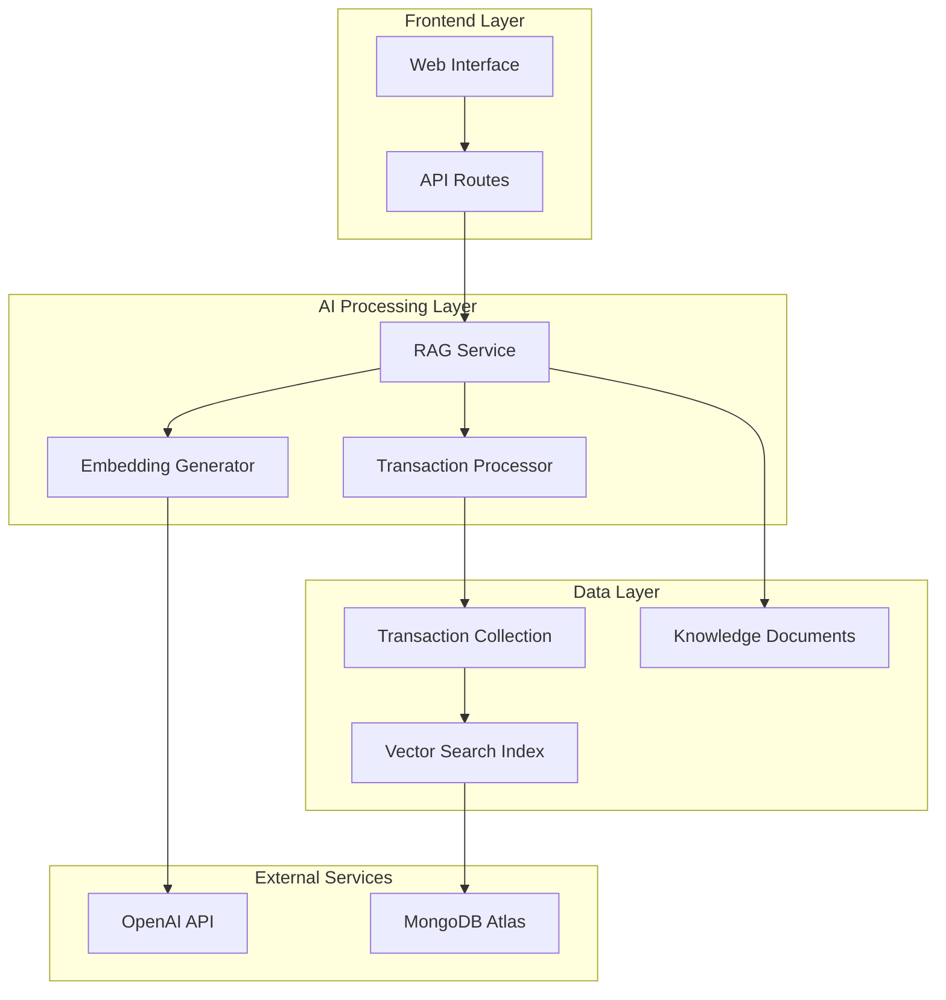
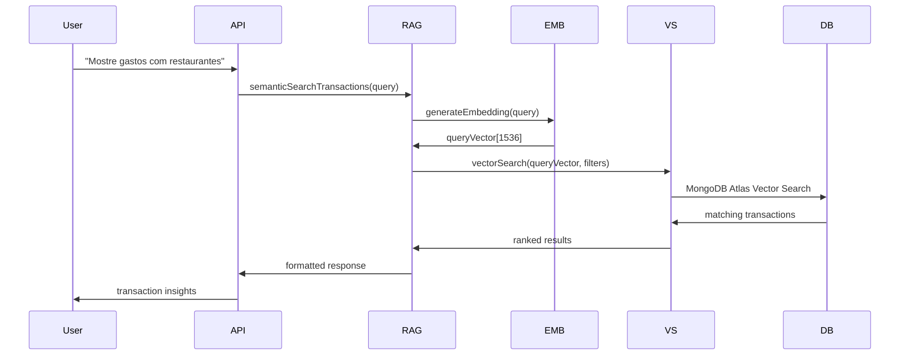

# Design Document

## Overview

Este documento descreve o design para implementar busca vetorial de transações no MongoDB Atlas, estendendo o sistema de busca vetorial existente para incluir transações financeiras. A solução permitirá que a IA realize buscas semânticas inteligentes no histórico de transações dos usuários, melhorando significativamente a qualidade das análises e recomendações financeiras.

O design aproveita a infraestrutura existente de embeddings (OpenAI), o sistema de busca vetorial já implementado para documentos de conhecimento, e o pipeline de processamento de transações, criando uma extensão natural e consistente da arquitetura atual.

## Architecture

### High-Level Architecture



### Transaction Vector Search Flow



## Components and Interfaces

### 1. Transaction Vector Search Service

**Location:** `packages/database/src/transaction-vector-search.ts`

```typescript
export class TransactionVectorSearchService {
  // Core search methods
  static async semanticSearchTransactions(
    query: TransactionVectorQuery
  ): Promise<TransactionSearchResult[]>;
  static async hybridSearchTransactions(
    query: TransactionHybridQuery
  ): Promise<TransactionSearchResult[]>;
  static async findSimilarTransactions(
    transactionId: string,
    limit?: number
  ): Promise<TransactionSearchResult[]>;

  // Index management
  static async createTransactionVectorIndex(): Promise<void>;
  static async updateTransactionEmbedding(
    transactionId: string,
    embedding: number[]
  ): Promise<ITransaction>;
  static async batchUpdateTransactionEmbeddings(
    updates: TransactionEmbeddingUpdate[]
  ): Promise<ITransaction[]>;

  // Analytics and monitoring
  static async getTransactionVectorStats(
    userId: string
  ): Promise<TransactionVectorStats>;
  static async removeTransactionEmbeddings(filter?: any): Promise<void>;
}
```

### 2. Transaction Embedding Generator

**Location:** `packages/ai/src/transaction/embedding-generator.ts`

```typescript
// Extends existing OpenAIEmbeddingProvider pattern
export class TransactionEmbeddingGenerator {
  private embeddingProvider: OpenAIEmbeddingProvider;

  constructor(apiKey: string) {
    this.embeddingProvider = new OpenAIEmbeddingProvider(apiKey);
  }

  // Generate embeddings for transaction content using existing preprocessDescription
  async generateTransactionEmbedding(
    transaction: ITransaction
  ): Promise<number[]>;
  async generateQueryEmbedding(query: string): Promise<number[]>;

  // Batch processing following existing patterns
  async batchGenerateEmbeddings(
    transactions: ITransaction[]
  ): Promise<TransactionEmbeddingResult[]>;

  // Content preparation using existing transaction preprocessing
  static prepareTransactionContent(transaction: ITransaction): string;
  static enhanceTransactionContext(
    transaction: ITransaction,
    userContext?: UserContext
  ): string;
}

// Reuse existing preprocessDescription from packages/ai/src/transaction/preprocess.ts
import { preprocessDescription } from './preprocess';
```

### 3. Enhanced Transaction Model

**Extension to:** `packages/database/src/models.ts`

```typescript
// Extend existing ITransaction interface (already defined in models.ts)
export interface ITransaction extends Document {
  userId: mongoose.Types.ObjectId;
  accountId: string;
  amount: number;
  currency: string;
  date: Date;
  description: string;
  category?: z.infer<typeof TransactionCategorySchema>;
  merchant?: z.infer<typeof MerchantSchema>;
  location?: z.infer<typeof LocationSchema>;
  metadata: z.infer<typeof TransactionMetadataSchema>;
  createdAt: Date;
  updatedAt: Date;
  deletedAt?: Date;

  // NEW: Vector search fields
  embedding?: number[]; // Vector embedding for semantic search
  embeddingVersion?: string; // Track embedding model version (e.g., "openai-ada-002-v1")
  embeddingGeneratedAt?: Date; // When embedding was created
  searchableContent?: string; // Preprocessed content used for embedding generation
}

// New search-specific schemas following VectorSearchService patterns
export const TransactionVectorQuerySchema = z.object({
  queryVector: z
    .array(z.number())
    .length(1536, 'Query vector must have 1536 dimensions'),
  userId: z.string(), // Required for security - only search user's own transactions
  numCandidates: z.number().min(1).max(1000).default(100),
  limit: z.number().min(1).max(100).default(10),
  filter: z
    .object({
      dateRange: z
        .object({
          start: z.date().optional(),
          end: z.date().optional(),
        })
        .optional(),
      amountRange: z
        .object({
          min: z.number().optional(),
          max: z.number().optional(),
        })
        .optional(),
      categories: z.array(z.string()).optional(), // category.primary values
      accountIds: z.array(z.string()).optional(),
      sources: z
        .array(z.enum(['open_finance', 'manual', 'csv_import']))
        .optional(), // metadata.source
    })
    .optional(),
  minScore: z.number().min(0).max(1).optional(),
});
```

### 4. RAG Integration Extension

**Extension to:** `packages/ai/src/rag/rag-service.ts`

```typescript
export class RAGService {
  // ... existing methods (semanticSearch, indexDocument, updateKnowledgeBase)

  // New transaction search methods following existing patterns
  async searchTransactions(
    query: string,
    userId: string,
    filters?: TransactionSearchFilters
  ): Promise<TransactionSearchResult[]>;

  async analyzeSpendingPatterns(
    query: string,
    userId: string,
    timeframe?: { start: Date; end: Date }
  ): Promise<SpendingAnalysis>;

  async getTransactionInsights(
    query: string,
    userId: string
  ): Promise<TransactionInsights>;

  // Combined search (documents + transactions) - extends existing SearchFilters interface
  async hybridFinancialSearch(
    query: string,
    userId: string,
    options?: HybridSearchOptions
  ): Promise<HybridSearchResult>;
}

// Extend existing SearchFilters interface
export interface TransactionSearchFilters extends SearchFilters {
  amountRange?: { min?: number; max?: number };
  accountIds?: string[];
  transactionSources?: ('open_finance' | 'manual' | 'csv_import')[];
}
```

### 5. API Integration

**New endpoint:** `apps/web/app/api/transactions/search/route.ts`

```typescript
// GET /api/transactions/search?q=query&filters=...
export async function GET(request: NextRequest): Promise<NextResponse>;

// POST /api/transactions/search (for complex queries)
export async function POST(request: NextRequest): Promise<NextResponse>;
```

### 6. Manual Setup Scripts

**For Phase 0 validation:** `packages/database/scripts/setup-transaction-vector-search.ts`

```typescript
// Script para configuração manual inicial
export async function setupTransactionVectorSearchManually(): Promise<void>;
export async function generateEmbeddingsForExistingTransactions(
  userId?: string
): Promise<void>;
export async function testVectorSearchQueries(): Promise<void>;
export async function validateSearchQuality(): Promise<void>;
```

## Data Models

### Transaction Embedding Schema

```typescript
// Extension to existing Transaction model
{
  // ... existing transaction fields
  embedding: number[],              // 1536-dimensional vector
  embeddingVersion: string,         // "openai-ada-002-v1"
  embeddingGeneratedAt: Date,       // Timestamp
  searchableContent: string,        // Processed content used for embedding
  embeddingMetadata: {
    contentLength: number,          // Length of processed content
    processingTime: number,         // Time taken to generate embedding
    confidence: number,             // Quality score of the embedding
    features: string[]              // Extracted features used in embedding
  }
}
```

### Vector Search Index Configuration

```typescript
export const TRANSACTION_VECTOR_INDEX_CONFIG = {
  name: 'transaction_vector_index',
  type: 'vectorSearch',
  definition: {
    fields: [
      {
        type: 'vector',
        path: 'embedding',
        numDimensions: 1536,
        similarity: 'cosine',
      },
      {
        type: 'filter',
        path: 'userId',
      },
      {
        type: 'filter',
        path: 'date',
      },
      {
        type: 'filter',
        path: 'amount',
      },
      {
        type: 'filter',
        path: 'category.primary',
      },
      {
        type: 'filter',
        path: 'accountId',
      },
      {
        type: 'filter',
        path: 'metadata.source',
      },
    ],
  },
};
```

### Search Result Schema

```typescript
export interface TransactionSearchResult {
  transaction: ITransaction;
  score: number;
  vectorScore?: number;
  textScore?: number;
  relevanceFactors: {
    semantic: number;
    temporal: number;
    categorical: number;
    amount: number;
  };
  explanation?: string;
}

export interface TransactionVectorStats {
  userId: string;
  totalTransactions: number;
  transactionsWithEmbeddings: number;
  embeddingCoverage: number;
  averageEmbeddingAge: number;
  categoriesWithEmbeddings: Record<string, number>;
  lastEmbeddingUpdate: Date;
}
```

## Error Handling

### Embedding Generation Errors

```typescript
export class EmbeddingError extends Error {
  constructor(
    message: string,
    public readonly transactionId?: string,
    public readonly retryable: boolean = true
  ) {
    super(message);
    this.name = 'EmbeddingError';
  }
}

export class VectorSearchError extends Error {
  constructor(
    message: string,
    public readonly query?: string,
    public readonly userId?: string
  ) {
    super(message);
    this.name = 'VectorSearchError';
  }
}
```

### Error Recovery Strategies

1. **Embedding Generation Failures:**
   - Retry with exponential backoff
   - Fallback to text-based search
   - Queue for later processing

2. **Vector Search Failures:**
   - Fallback to traditional MongoDB queries
   - Use cached results when available
   - Graceful degradation with reduced functionality

3. **Index Issues:**
   - Automatic index recreation
   - Health checks and monitoring
   - Alert system for critical failures

## Testing Strategy

### Unit Tests

1. **Transaction Embedding Generation:**
   - Test content preparation and preprocessing
   - Validate embedding dimensions and quality
   - Test error handling and edge cases

2. **Vector Search Operations:**
   - Test query vector generation
   - Validate search result ranking
   - Test filter combinations

3. **Integration with Existing Systems:**
   - Test RAG service integration
   - Validate API endpoint responses
   - Test database operations

### Integration Tests

1. **End-to-End Search Flow:**
   - User query → embedding → search → results
   - Test with real transaction data
   - Validate performance benchmarks

2. **MongoDB Atlas Vector Search:**
   - Test index creation and management
   - Validate search performance
   - Test with large datasets

3. **API Integration:**
   - Test REST endpoints
   - Validate authentication and authorization
   - Test error responses

### Performance Tests

1. **Embedding Generation:**
   - Batch processing performance
   - Memory usage optimization
   - API rate limiting compliance

2. **Vector Search Performance:**
   - Query response times
   - Concurrent user handling
   - Large dataset performance

3. **System Integration:**
   - End-to-end latency
   - Resource utilization
   - Scalability testing

### Test Data Strategy

1. **Synthetic Transaction Data:**
   - Generate diverse transaction types
   - Include edge cases and anomalies
   - Multilingual descriptions (Portuguese focus)

2. **Real-world Scenarios:**
   - Common user queries
   - Complex search patterns
   - Performance stress tests

3. **Privacy-Compliant Testing:**
   - Anonymized real data
   - Synthetic but realistic patterns
   - LGPD compliance validation

## Implementation Approaches

### Approach 1: Manual Setup (Quick Start)

**Para testes e validação inicial:**

1. Adicionar campo `embedding` manualmente no MongoDB Atlas
2. Criar índice vetorial via interface do Atlas
3. Gerar embeddings para transações existentes via script
4. Testar buscas vetoriais diretamente no Atlas

**Vantagens:** Rápido para testar conceito
**Desvantagens:** Não escalável, sem automação

### Approach 2: Automated Integration (Production)

**Para implementação completa no sistema:**

1. Estender modelo de Transaction programaticamente
2. Automação de geração de embeddings
3. Integração com pipeline de transações existente
4. APIs para busca vetorial integradas ao sistema

**Vantagens:** Escalável, integrado, automatizado
**Desvantagens:** Mais complexo, requer desenvolvimento completo

### Approach 3: Hybrid (Recomendado)

**Combinação das duas abordagens:**

1. **Fase Manual:** Setup inicial e validação
2. **Fase Automatizada:** Implementação completa
3. **Migração:** Transição suave entre as fases

## Implementation Phases

### Phase 0: Manual Validation (1-2 dias)

**Objetivo:** Validar conceito e configurar infraestrutura básica

- Adicionar campo `embedding` manualmente via MongoDB Atlas UI
- Criar índice vetorial via Atlas Search
- Script para gerar embeddings de transações existentes
- Testes manuais de busca vetorial
- Validação de qualidade dos resultados

### Phase 1: Core Infrastructure (1 semana)

**Objetivo:** Implementar base programática

- Extend Transaction model with embedding fields
- Create TransactionVectorSearchService
- Implement basic embedding generation
- Automated MongoDB Atlas vector index creation
- Migration scripts for existing data

### Phase 2: Search Functionality (1 semana)

**Objetivo:** Implementar funcionalidades de busca

- Implement semantic search methods
- Add hybrid search capabilities
- Create API endpoints
- Basic error handling and logging
- Integration with existing transaction APIs

### Phase 3: RAG Integration (1 semana)

**Objetivo:** Integrar com sistema de IA

- Extend RAG service for transactions
- Implement combined search (documents + transactions)
- Add transaction insights and analysis
- Enhanced user context integration
- Chat interface integration

### Phase 4: Optimization & Production (1 semana)

**Objetivo:** Otimizar e preparar para produção

- Performance optimization
- Advanced analytics and monitoring
- Batch processing improvements
- Production deployment and monitoring
- User acceptance testing

## Security Considerations

### Data Privacy

- User isolation in vector searches
- Embedding content sanitization
- Audit logging for search operations
- LGPD compliance for transaction data

### API Security

- Authentication required for all endpoints
- Rate limiting on search operations
- Input validation and sanitization
- SQL injection prevention

### Vector Data Security

- Encrypted storage of embeddings
- Secure transmission of vector data
- Access control for vector operations
- Regular security audits

## Performance Considerations

### Embedding Generation

- Batch processing for efficiency
- Async processing for new transactions
- Caching strategies for repeated content
- Rate limiting for OpenAI API

### Vector Search Optimization

- Proper index configuration
- Query optimization techniques
- Result caching strategies
- Connection pooling

### Scalability

- Horizontal scaling support
- Database sharding considerations
- CDN for static resources
- Load balancing strategies

## Monitoring and Analytics

### Key Metrics

- Embedding generation success rate
- Search query performance
- User engagement with search results
- System resource utilization

### Alerting

- Failed embedding generations
- Vector search errors
- Performance degradation
- Index health issues

### Analytics Dashboard

- Search usage patterns
- Popular query types
- Performance trends
- User satisfaction metrics
