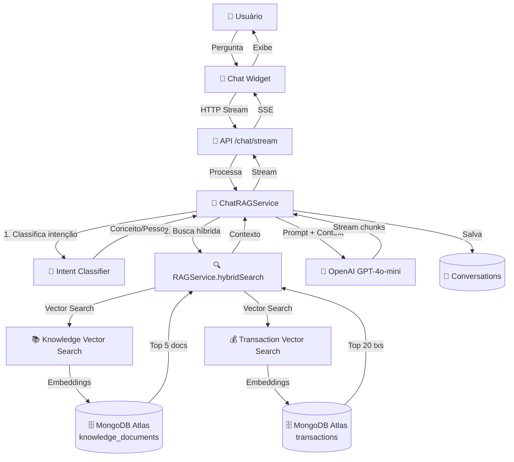

# Linio - Assistente de IA Financeira Pessoal

<div align="center">

**Plataforma inteligente de gestão financeira pessoal com IA conversacional baseada em RAG (Retrieval-Augmented Generation)**

[](https://www.typescriptlang.org/)
[](https://nextjs.org/)
[](https://www.mongodb.com/atlas)
[](https://openai.com/)
[](LICENSE)

[Características](#-características-principais) •
[Arquitetura](#-arquitetura) •
[Instalação](#-instalação-rápida) •
[Documentação Completa](https://deepwiki.com/eduesplinio/financial-ai-agent)

</div>

---

## 📖 Sobre o Projeto

**Linio** é um assistente financeiro pessoal inteligente que combina análise de dados financeiros com inteligência artificial conversacional. Utilizando arquitetura RAG (Retrieval-Augmented Generation), o sistema oferece orientação financeira personalizada baseada em dados reais do usuário, integração com Open Finance, e uma base de conhecimento financeiro atualizada.

### 🎯 Problema que Resolve

- **Falta de educação financeira acessível**: Democratiza o acesso a consultoria financeira de qualidade
- **Dificuldade em entender padrões de gastos**: Análise automática e insights sobre comportamento financeiro
- **Informações financeiras fragmentadas**: Centraliza dados de múltiplas contas bancárias
- **Decisões financeiras desinformadas**: Fornece recomendações baseadas em dados e conhecimento especializado

### 🏆 Diferenciais

- ✅ **RAG Híbrido**: Combina busca vetorial em base de conhecimento + análise de transações pessoais
- ✅ **MongoDB Atlas Vector Search**: Busca semântica nativa para documentos e transações
- ✅ **Conversação Contextual**: Mantém histórico e contexto entre mensagens
- ✅ **Open Finance Ready**: Preparado para integração com APIs bancárias brasileiras
- ✅ **LGPD Compliant**: Arquitetura pensada para conformidade com privacidade de dados
- ✅ **Monorepo Escalável**: Estrutura modular com Turborepo para crescimento sustentável

---

## ✨ Características Principais

### 🤖 IA Conversacional com RAG

- **Chat inteligente** com streaming de respostas em tempo real
- **Busca semântica** em base de conhecimento financeiro (1536-dimensional embeddings)
- **Análise de transações** com busca vetorial para insights personalizados
- **Classificação automática** de intenções (educação, análise, investimentos)
- **Memória conversacional** persistente no MongoDB
- **Citação de fontes** rastreáveis para todas as respostas

### 💰 Gestão Financeira

- **Dashboard interativo** com métricas financeiras em tempo real
- **Categorização automática** de transações usando ML (Naive Bayes + TF-IDF)
- **Detecção de anomalias** e transações duplicadas
- **Análise de padrões** de gastos e receitas
- **Visualizações** com Chart.js (gastos por categoria, tendências temporais)
- **Metas financeiras** com acompanhamento de progresso

### 🔐 Segurança e Autenticação

- **NextAuth.js v5** com suporte a múltiplos provedores
- **RBAC (Role-Based Access Control)** com 20+ permissões granulares
- **3 níveis de acesso**: User, Support, Admin
- **Criptografia** de dados sensíveis (bcrypt para senhas)
- **Sessões JWT** com refresh token rotation
- **Middleware** de proteção de rotas e APIs

### 🏦 Integração Open Finance

- **Cliente HTTP** robusto com retry exponencial e rate limiting
- **Autenticação OAuth2** para instituições financeiras
- **Sincronização automática** de contas e transações
- **Webhooks** para atualizações em tempo real
- **Sandbox** para testes de desenvolvimento
- **Gerenciamento de consentimentos** conforme regulamentação BCB

### 📊 Base de Dados Avançada

- **MongoDB Atlas** com Vector Search nativo
- **2 índices vetoriais**: knowledge_documents (educação) + transactions (análise pessoal)
- **Schemas Mongoose** com validação Zod
- **Soft delete** e auditoria de dados
- **Agregation pipelines** para análises complexas
- **Scripts de seed** para popular dados iniciais

---

## 🏗️ Arquitetura

### Stack Tecnológica

```
Frontend:
├── Next.js 14 (App Router)
├── React 18 + TypeScript
├── Tailwind CSS + Radix UI
├── React Hook Form + Zod
└── Chart.js para visualizações

Backend:
├── Next.js API Routes
├── NextAuth.js v5
├── MongoDB Atlas (Vector Search)
├── Mongoose ODM
└── OpenAI GPT-4o-mini

AI/ML:
├── OpenAI Embeddings (text-embedding-3-small)
├── LangChain para orquestração
├── Naive Bayes para categorização
├── TF-IDF para processamento de texto
└── Isolation Forest para detecção de anomalias

Infraestrutura:
├── Turborepo (monorepo)
├── Docker Compose (dev)
├── ESLint + Prettier + Husky
└── Jest + Testing Library
```

### Arquitetura de Monorepo

```
linio/
├── apps/
│   └── web/                    # Next.js frontend + API routes
│       ├── app/                # App Router (pages, layouts, API)
│       ├── components/         # React components
│       ├── lib/                # Services (auth, chat-rag, rbac)
│       └── hooks/              # Custom React hooks
│
├── packages/
│   ├── ai/                     # 🧠 Sistema RAG e ML
│   │   ├── src/chat/           # Intent classification
│   │   ├── src/conversation/   # Context management
│   │   ├── src/financial/      # Pattern analysis, alerts
│   │   ├── src/llm/            # LLM service, prompt engineering
│   │   ├── src/nlp/            # NLP pipeline (PT-BR)
│   │   ├── src/rag/            # RAG system (chunking, embeddings, search)
│   │   ├── src/services/       # Enhanced RAG, user data service
│   │   └── src/transaction/    # ML categorizer, anomaly detector
│   │
│   ├── database/               # 💾 MongoDB + Vector Search
│   │   ├── src/models.ts       # Mongoose schemas
│   │   ├── src/vector-search.ts        # Knowledge documents search
│   │   ├── src/transaction-vector-search.ts  # Transaction search
│   │   └── scripts/            # Setup, population, testing
│   │
│   ├── open-finance/           # 🏦 Open Finance integration
│   │   ├── src/client.ts       # HTTP client
│   │   ├── src/auth.ts         # OAuth2
│   │   ├── src/sync.ts         # Data synchronization
│   │   └── src/webhook.ts      # Real-time updates
│   │
│   └── shared/                 # 🔧 Shared utilities
│       ├── src/types/          # TypeScript types
│       ├── src/constants/      # Constants
│       └── src/utils/          # Utilities
│
└── docs/                       # 📚 Documentation
```

### Fluxo de Dados RAG



---

## 🚀 Instalação Rápida

### Pré-requisitos

- **Node.js** 18+ e **pnpm** 8+
- **MongoDB Atlas** account (free tier funciona)
- **OpenAI API Key** ([obter aqui](https://platform.openai.com/api-keys))
- **Docker** (opcional, para desenvolvimento local)

### 1. Clone e Instale

```bash
# Clone o repositório
git clone <repository-url>
cd linio

# Instale dependências
pnpm install
```

### 2. Configure Variáveis de Ambiente

```bash
# Copie o arquivo de exemplo
cp .env.example .env.local
```

Edite `.env.local` com suas configurações:

```env
# MongoDB Atlas
MONGODB_URI=mongodb+srv://<user>:<password>@<cluster>.mongodb.net/financial_ai?retryWrites=true&w=majority

# NextAuth.js
NEXTAUTH_URL=http://localhost:3000
NEXTAUTH_SECRET=<gere-uma-chave-secreta-com-32+-caracteres>

# OpenAI
OPENAI_API_KEY=sk-...

# OAuth (opcional para teste)
GOOGLE_CLIENT_ID=your-google-client-id
GOOGLE_CLIENT_SECRET=your-google-client-secret
```

### 3. Configure MongoDB Atlas

#### 3.1 Crie os Índices Vetoriais

No MongoDB Atlas UI:

1. Acesse **Database** → **Browse Collections**
2. Selecione database `financial_ai`
3. Vá em **Search** → **Create Search Index**
4. Escolha **JSON Editor** e cole:

**Para `knowledgedocuments`:**

```json
{
  "name": "knowledge_vector_index",
  "type": "vectorSearch",
  "definition": {
    "fields": [
      {
        "type": "vector",
        "path": "embedding",
        "numDimensions": 1536,
        "similarity": "cosine"
      }
    ]
  }
}
```

**Para `transactions`:**

```json
{
  "name": "transaction_vector_index",
  "type": "vectorSearch",
  "definition": {
    "fields": [
      {
        "type": "vector",
        "path": "embedding",
        "numDimensions": 1536,
        "similarity": "cosine"
      }
    ]
  }
}
```

#### 3.2 Popule a Base de Conhecimento

```bash
# Popular documentos financeiros com embeddings
cd packages/database
pnpm run setup:vector-search

# Verificar se funcionou
pnpm run test:vector-search-queries
```

### 4. Inicie a Aplicação

```bash
# Desenvolvimento
pnpm dev

# Build de produção
pnpm build
pnpm start
```

Acesse: **http://localhost:3000**

### 5. Crie seu Primeiro Usuário

1. Vá para `/auth/signup`
2. Preencha o formulário
3. Faça login em `/auth/signin`
4. Explore o dashboard!

---

## 📚 Documentação

### Guias de Uso

#### Como Usar o Chat IA

O chat entende dois tipos de perguntas:

**1. Perguntas sobre Conceitos Financeiros** (usa base de conhecimento)

```
Usuário: "O que é Tesouro Direto?"
IA: [Busca em knowledge_documents e explica]

Usuário: "Como funciona o MEI?"
IA: [Busca documentos sobre MEI]
```

**2. Perguntas sobre Seus Dados** (usa suas transações)

```
Usuário: "Quanto gastei com alimentação?"
IA: [Analisa suas transações da categoria Alimentação]

Usuário: "Qual meu saldo?"
IA: [Calcula receitas - despesas]
```

**3. Perguntas de Acompanhamento** (usa contexto)

```
Usuário: "O que é Bitcoin?"
IA: [Explica Bitcoin]

Usuário: "Como comprar?"
IA: [Entende que é sobre Bitcoin e explica como comprar]
```

#### Como Testar Autenticação e RBAC

```bash
# Verificar configuração
cd apps/web
node scripts/verify-auth.js

# Testar funções RBAC
node scripts/test-rbac-functions.js
```

**Alterar role de um usuário:**

```javascript
// No MongoDB Compass ou shell
db.users.updateOne(
  { email: 'seu@email.com' },
  { $set: { role: 'admin' } } // ou "support", "user"
);
```

**Permissões por Role:**

- **User**: Perfil próprio, transações próprias, metas, chat
- **Support**: + Visualizar perfis de usuários, assistir usuários
- **Admin**: Todas as permissões (gerenciar usuários, logs, sistema)

#### Como Popular Transações de Teste

```bash
cd packages/database

# Popular usuários
pnpm tsx scripts/populate-users.ts

# Popular transações
pnpm tsx scripts/populate-transactions.ts

# Gerar embeddings para transações
pnpm tsx scripts/generate-transaction-embeddings.ts

# Testar busca vetorial de transações
pnpm tsx scripts/test-transaction-vector-search.ts
```

---

## 🧪 Testes

### Executar Testes

```bash
# Todos os testes
pnpm test

# Testes com watch mode
pnpm test:watch

# Cobertura
pnpm test:coverage

# Testes E2E
pnpm test:e2e
```

### Testes Específicos

```bash
# Testar autenticação
cd apps/web
node scripts/verify-auth.js

# Testar RBAC
node scripts/test-rbac-functions.js

# Testar Vector Search
cd packages/database
pnpm run test:vector-search-queries

# Testar Transaction Vector Search
pnpm run test:transaction-vector-search

# Testar RAG completo
cd packages/ai
pnpm run test:rag-integration
```

### Cobertura Atual

- ✅ **Autenticação**: 20/20 testes RBAC passando
- ✅ **Vector Search**: Busca semântica funcionando
- ✅ **Transaction Search**: Busca vetorial de transações OK
- ✅ **Chat RAG**: Integração completa testada
- ✅ **Open Finance**: Cliente HTTP, OAuth2, sincronização implementados

---

## 🔧 Scripts Disponíveis

### Desenvolvimento

```bash
pnpm dev              # Inicia modo desenvolvimento
pnpm build            # Build de produção
pnpm start            # Inicia servidor de produção
pnpm clean            # Limpa builds e cache
```

### Qualidade de Código

```bash
pnpm lint             # Executa ESLint
pnpm lint:fix         # Corrige problemas do ESLint
pnpm format           # Formata código com Prettier
pnpm format:check     # Verifica formatação
pnpm type-check       # Verifica tipos TypeScript
```

### Banco de Dados

```bash
# Vector Search
cd packages/database
pnpm run setup:vector-search                    # Cria índice e popula conhecimento
pnpm run setup:transaction-vector-search        # Cria índice de transações
pnpm run test:vector-search-queries             # Testa busca de documentos
pnpm run test:transaction-vector-search         # Testa busca de transações

# População de Dados
pnpm tsx scripts/populate-users.ts              # Cria usuários de teste
pnpm tsx scripts/populate-transactions.ts       # Cria transações de teste
pnpm tsx scripts/populate-knowledge-documents.ts # Popula base de conhecimento
pnpm tsx scripts/generate-transaction-embeddings.ts # Gera embeddings

# Verificação
pnpm tsx scripts/verify-embeddings.ts           # Verifica embeddings
pnpm tsx scripts/check-all-docs.ts              # Verifica documentos
```

### Utilitários

```bash
# Criar usuário de teste
pnpm create:user

# Migrações
cd scripts/migrations
node migrate-user-profile.js
```

---

## 🤝 Contribuindo

Contribuições são bem-vindas! Por favor, siga estas diretrizes:

### Como Contribuir

1. **Fork** o projeto
2. **Crie uma branch** para sua feature (`git checkout -b feature/AmazingFeature`)
3. **Commit** suas mudanças (`git commit -m 'Add some AmazingFeature'`)
4. **Push** para a branch (`git push origin feature/AmazingFeature`)
5. **Abra um Pull Request**

### Padrões de Código

- **TypeScript**: Strict mode, sem `any` desnecessários
- **ESLint**: Todas as regras devem passar
- **Prettier**: Código formatado automaticamente
- **Commits**: Conventional Commits (`feat:`, `fix:`, `docs:`, etc.)
- **Testes**: Adicione testes para novas funcionalidades

### Estrutura de Commits

```
feat: adiciona busca vetorial de transações
fix: corrige timeout na conexão MongoDB
docs: atualiza README com instruções de setup
refactor: melhora performance do RAG service
test: adiciona testes para categorização
```

---

## 📄 Licença

Este projeto está sob a licença **MIT**. Veja o arquivo [LICENSE](LICENSE) para mais detalhes.

---

## 🔗 Links Úteis

- **[📚 Documentação Completa do Projeto](https://deepwiki.com/eduesplinio/financial-ai-agent)** - Documentação detalhada com specs, design e implementação
- [Documentação MongoDB Atlas Vector Search](https://www.mongodb.com/docs/atlas/atlas-vector-search/vector-search-overview/)
- [OpenAI Embeddings Guide](https://platform.openai.com/docs/guides/embeddings)
- [Next.js 14 Documentation](https://nextjs.org/docs)
- [NextAuth.js v5 Guide](https://authjs.dev/)
- [Open Finance Brasil](https://openbankingbrasil.org.br/)
- [LGPD - Lei Geral de Proteção de Dados](https://www.gov.br/cidadania/pt-br/acesso-a-informacao/lgpd)

---

<div align="center">
r

</div>
